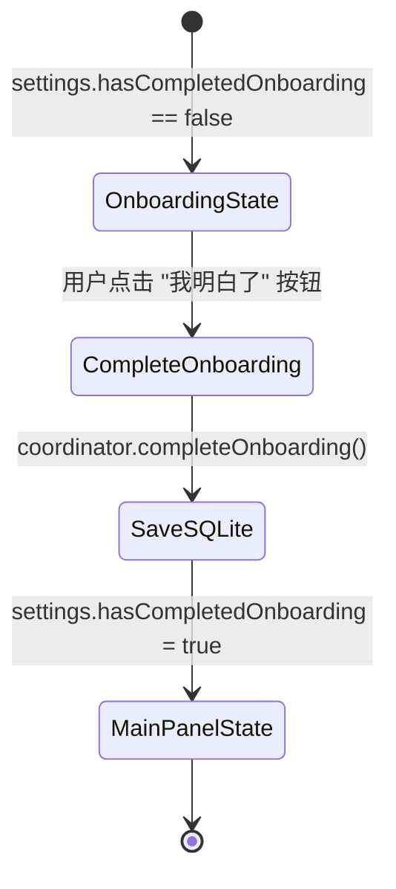

# 02. 新手引导页 (Onboarding View)

## 新手引导页
- 用户称呼：Onboarding 面板、新手引导、首次使用声明页、规则声明页
- 入口：应用安装或清空数据后首次启动，点击菜单栏图标（`settings.hasCompletedOnboarding == false`）
- 关键选择器：`window 1 of application "ResourceSteward"`；AXTitle=`"资源管家"`；主要按钮: `button "我明白了"` (`app.buttons["我明白了"]`)；声明卡片容器: `OnboardPoint`
- 子功能：明确产品 Non-Goals 能力边界（不承诺直接压缩内存）、四条核心交互原则展示、一键确认并持久化进入主界面
- 前置条件：本地 SQLite 数据库中 `hasCompletedOnboarding` 为 `false`
- 常见故障现象：点击“我明白了”无响应或无法切入主面板 → 本地 SQLite 写入受阻或 store 未能持久化；每次启动均重复出现引导 → 数据库 fallback 到 NSTemporaryDirectory

---

### 可见控件与属性字典

| 控件名称 | 控件类型 (SwiftUI) | macOS AX 角色 | 定位方式 / 选择器 | 可视内容 / 文本 | 交互事件 |
|---|---|---|---|---|---|
| 引导窗口容器 | `OnboardingView` | `AXWindow` / `AXGroup` | `window 1 of application "ResourceSteward"` | 尺寸 430x630 pt | 整体承载 |
| 产品标志图标 | `Image(systemName: "memorychip")` | `AXImage` | `image 1 of window 1` | 28pt 芯片图标（正常色） | 纯视觉展示 |
| 主标题 | `Text("资源管家")` | `AXStaticText` | `static text 1 whose value is "资源管家"` | "资源管家" (.title3, weight: .semibold) | 标题展示 |
| 副标题 | `Text("先看清它能做什么、不能做什么")` | `AXStaticText` | `static text 2` | "先看清它能做什么、不能做什么" | 副标题展示 |
| 原则条目 1 | `OnboardPoint` (icon: `rectangle.3.group`) | `AXGroup` | 条目标题: `"看负载和正在运行的灰区 App"` | 说明前台、VPN/IM、常用与系统进程不受打扰 | 信息卡片 |
| 原则条目 2 | `OnboardPoint` (icon: `hand.raised`) | `AXGroup` | 条目标题: `"不会直接压缩或回收内存"` | 明确指出 macOS 没有公开 API 能压缩内存 | 信息卡片 |
| 原则条目 3 | `OnboardPoint` (icon: `pause.rectangle`) | `AXGroup` | 条目标题: `"默认只建议，半自动可在设置里打开"` | 说明 Level 0 独立确认与 Level 1 通知栏自动机制 | 信息卡片 |
| 原则条目 4 | `OnboardPoint` (icon: `questionmark.circle`) | `AXGroup` | 条目标题: `"「预计可释放」是估算"` | 声明数字来自当前占用，不构成承诺 | 信息卡片 |
| 完成引导按钮 | `Button("我明白了")` | `AXButton` | `button "我明白了"` (`app.buttons["我明白了"]`) | 文本: `"我明白了"` (.borderedProminent, .large) | 单击完成引导并持久化设置 |

### 状态迁移图



### 自动化测试代码参考

```applescript
-- AppleScript: 点击 "我明白了" 完成引导
tell application "System Events"
    tell process "ResourceSteward"
        tell window 1
            click button "我明白了"
        end tell
    end tell
end tell
```

```swift
// XCUITest
let app = XCUIApplication(bundleIdentifier: "cc.resourcesteward")
let confirmBtn = app.buttons["我明白了"]
if confirmBtn.exists {
    confirmBtn.click()
}
```
