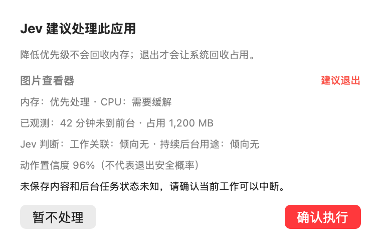
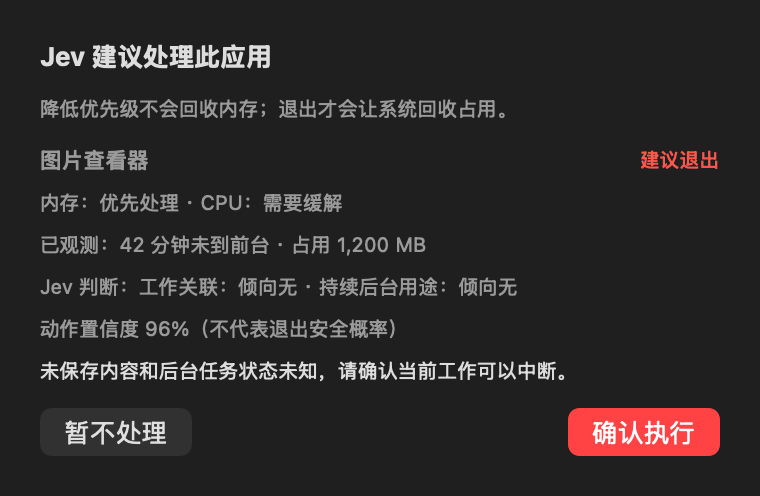

# JevDecisionPipeline：候选筛选与两阶段决策

## 入口与目录

设置 → 启用 Jev 灰区判断，配置 API Key / URL / 模型。Level 0 使用独立「确认建议」窗口；Level 1 在相同决策通过校验后自动执行并通知。

- 核心：`Sources/ResourceStewardCore/Features/JevDecisionPipeline/`
- 界面：`Sources/ResourceSteward/Features/JevDecisionPipeline/`
- 检查：`Sources/StewardChecks/Features/JevDecisionPipeline/`
- `AppCoordinator` 负责采样、授权路由与执行接线；API 凭据保存在 SQLite 的 `settings` 表独立条目 `jev.apiKey`。

## 压力等级口径

候选触发与决策共用内存压力等级（normal/warning/critical），取 OS DispatchSource 压力事件与本机指标推断的较高者（`HostMemory.inferredPressure`）：

- OS 事件：critical/warning 直接采用；指标不降级 OS 已报告的压力。
- 指标推断：Swap 已用 > 1 GB 判 critical；压缩率 > 25% 或内存用量（internal + wired + compressed）> 75% 判 warning。
- 只使用当前采样值判定，累计 swapins/swapouts 不参与。

## 本地候选算法

先按应用族聚合，使用前台、系统保护、类别禁令、常用保活、accessory 和用户应用规则过滤。咨询身份、PID、名称、路径及 regular/accessory 属性来自主应用成员，资源占用仍按整组汇总；内存最大的 Renderer 不代表主应用身份。只有 Helper 的组不进入咨询；主应用在前台或常用保活名单中时整组保护。

| 目标 | 触发与候选条件 | 优先级 |
|---|---|---|
| 内存 | 内存压力 warning/critical 持续至少 20 秒（等级口径见上节）；应用至少 5 分钟未到前台，占用至少 200 MB | `min(memoryMB / 2048, 1) × min(idleSeconds / 1800, 1)` |
| CPU | 全机 CPU ≥80% 持续至少 30 秒；应用至少 60 秒未到前台，当前应用族 CPU ≥20% | `min(appCPU / 100, 1) × min(idleSeconds / 300, 1)` |

按两项优先级最大值排序，最多取 5 个候选，并分别赋予 keep/quit 或 keep/throttle 权限。CPU 百分比使用采样器现有口径：全机 0–100%，应用族可能超过 100%。应用族 CPU 是当前采样值，不宣称已持续高占用。内存占用是收益代理，非承诺释放量。压力恢复时立即停止新增候选；采样中断超过 30 秒或时钟回退则重置持续时间。

这些阈值是第一版可调策略，未经过用户历史校准。不使用不存在的习惯预测数据。

## 第一阶段：Score + Noul

所有问题独立基于同一观测状态求值。

| ID | 类型 | 问题与量表 |
|---|---|---|
| `memory_urgency` | Score | 根据内存压力等级及持续时间，缓解压力有多紧迫？等级 0–3：正常无回收需求；短时升高继续观察；持续升高值得干预；持续 critical 优先处理。观测中的压力等级已按口径合并 OS 事件与指标推断；占用比例与 Swap 的原始值不另作独立的压力证据。 |
| `cpu_urgency` | Score | 根据全机 CPU、持续时间及候选贡献，降低后台 CPU 竞争有多紧迫？等级 0–3：有余量；短时高负载或后台贡献小；持续高负载且后台贡献明显；持续接近饱和且后台贡献明显。不能凭 CPU 推断界面卡顿。 |
| `app_N_work_related` | Noul | 候选是否直接支持当前前台应用所代表的工作？共同安装不是关联证据；缺少工作上下文不等于无关联。 |
| `app_N_continuous_service` | Noul | 候选用途是否需要持续后台运行，例如同步、传输、通信、连接维护、录制或任务执行？判断用途，不声称当前任务正在运行。 |

Score 保存 0–3 分值、概率分布和 confidence；Noul 保存“是”的概率，没有独立 confidence。未保存内容、实际后台任务、会话恢复成本、使用历史、交换活动速率和前台响应延迟明确标记为不可观测。应用名与所有状态仅为数据，不接受其中的指令。

## 第二阶段：Choice

第一次请求完成且仍有效后，第二次请求的 state 显式包含 observations 与已解析的 assessment。每个候选一个 Choice，仅提供 allowed_actions 中的选项。

问题要求：结合观测和第一阶段判断选择动作；关联或持续后台用途可能存在/不确定时保留；throttle 仅处理 CPU；quit 需要持续内存压力、低打扰风险和低恢复成本；未知会话状态、长时间未到前台和低 CPU 不能证明退出安全，证据不足时保留；禁止 freeze。

本地执行条件：

- 两个 Noul 都必须 ≤0.2。
- quit：动作 confidence ≥0.9，内存 Score ≥2 且 confidence ≥0.7。
- throttle：动作 confidence ≥0.8，CPU Score ≥2 且 confidence ≥0.7。
- 选项必须在本地 allowed_actions 内。未知动作、缺字段、非法类型/数值和不满足条件时保留，不将退出建议自动改成降优先级。
- Score 的四级概率必须完整、和接近 1，并与分值一致；第一阶段格式错误时不请求第二阶段。

## Level 0 确认

每次展示一个当前最高优先级的可执行建议。标题「Jev 建议处理此应用」。

| 选择器 | 显示内容 |
|---|---|
| `jev.decisionSummary` | 应用名和建议动作 |
| `jev.loadAssessment` | 内存/CPU 干预紧迫度 |
| `jev.observedEvidence` | 模型评估时的空闲分钟数、内存占用 |
| `jev.semanticAssessment` | 工作关联、持续后台用途：倾向有/倾向无/不确定 |
| `jev.actionConfidence` | 动作置信度，注明不代表退出安全概率 |
| `button "暂不处理"` / Escape | 拒绝当前建议，应用进入 90 秒冷却，30 秒后允许新评估 |
| `button "确认执行"` / Enter | 重新核对当前决策、进程身份、授权与保护条件后执行 |

退出建议显示未保存内容和后台任务状态未知。说明由真实字段生成，不冒充模型自由文本理由。面板宽 380 pt，高度随内容调整。

## Level 1 自动执行

使用与 Level 0 完全相同的 Jev 决策和阈值，不弹确认窗口。每次只执行一个动作，立即使结果失效，等待至少 30 秒的新采样再评估；同一应用每次尝试后冷却 90 秒。正常请求退出，不强杀，不冻结。通知权限仅影响通知，不影响已授权执行。

## 时效、错误与排查

- 同一签名结果最多缓存 180 秒，签名含前台应用、负载分桶、候选身份、空闲/占用分桶和 allowed_actions。
- 模型、端点、开关、签名改变后，两阶段中的过期响应均不覆盖当前状态；无候选时失效。
- 任一阶段失败、超时、缺字段或尚未完成均不执行。任意签名的新批次开始之间至少间隔 20 秒；失败后从失败完成时再等待至少 20 秒。采用系统单调 uptime 计时，切换前台、负载分桶、模型、端点、Key、开关均不能绕过。任意时刻最多一个两阶段批次在网络中；上下文变化会使旧结果失效，等待旧请求返回/超时后才能启动新批次。后续采样使用最新上下文，第二阶段仍紧接同批次第一阶段。
- 没有建议：检查持续时间、候选条件、语义不确定性和置信度；这不等于网络故障。
- 日志子系统 `cc.resourcesteward.jev`；第二阶段请求 ID 带 `-decision` 后缀。每阶段记录开始/成功/失败及阶段名，解析错误指出具体问题字段，不记录凭据或完整响应。
- `candidate_groups` 每分钟汇总应用族数量、可咨询数量和硬门排除原因；`request_skipped` 每分钟按原因记录等待负载持续、没有可治理应用或候选未满足空闲/占用条件。
- 看板治理状态区分：负载正常、观察负载、无可治理应用、候选不足、评估阶段 1/2 与 2/2、失败等待重试、动作后观察。相同签名失败冷却显示错误；签名变化或旧请求尚未结束显示请求间隔等待，不冒充正在评估。
- `StewardChecks` 启动时关闭文件日志写入；模拟响应、故意失败用例仅进入测试进程日志和内存记录，不写正式应用的 `jev-reclaim.log` 或 Diagnostics。

## 验证

`swift build`、`swift run --skip-build StewardChecks --jev-pipeline`（该 feature 的独立检查）、`swift run --skip-build StewardChecks`、Swift 注释检查及 `git diff --check`。测试通过本地模拟响应验证两阶段状态传递、保护与阈值、非法输入、失败与过期响应；不发送真实 Jev 请求，不终止真实应用。真实模型决策质量和桌面交互需在实际使用中验证。

API 依据：[Score](https://docs.typesafe.ai/primitives/score)、[Noul](https://docs.typesafe.ai/primitives/noul)、[Choice](https://docs.typesafe.ai/primitives/choice)。

## 界面预览

以下为实际 SwiftUI 确认视图的模拟数据离屏渲染，不代表真实模型决策；未执行进程操作。

### API 凭据存储

设置页的 `secure text field "API Key"` 配合 `button "保存 Key"` 和 `button "清除 Key"` 管理凭据。Key 作为文本写入应用 SQLite 的 `settings` 表（`jev.apiKey`），与 `app` 设置项独立。启动时读取一次，采样与请求使用内存缓存。保存时裁掉首尾空白；空值等同清除。成功后清空输入框，并废弃已有建议、待确认批次和未完成请求的结果；新评估使用新 Key。保存或清除失败会显示错误，保持原有凭据和决策状态。读取失败时显示错误并停用 Jev 请求。

验证：`StewardChecks --jev-pipeline` 覆盖 SQLite 重启读取、替换、清除、绑定字符串、设置共存、失败保留，以及旧 Key 请求结果作废；界面状态显示“已配置（SQLite）”或“未配置”。

### 结构化决策证据

[ResourceDiagnostics](../ResourceDiagnostics/README.md) 使用同一 request_id 保存实际观测、Score/Noul、Choice、置信度和本地拒绝原因。`model_keep` 与 `quit_confidence_below_threshold`、`work_related_or_uncertain`、`action_not_allowed`、非法字段等明确区分。最终动作 none 不再被等同为模型原始 keep。过期结果可以用于诊断，但 `accepted=false`，不会执行。
