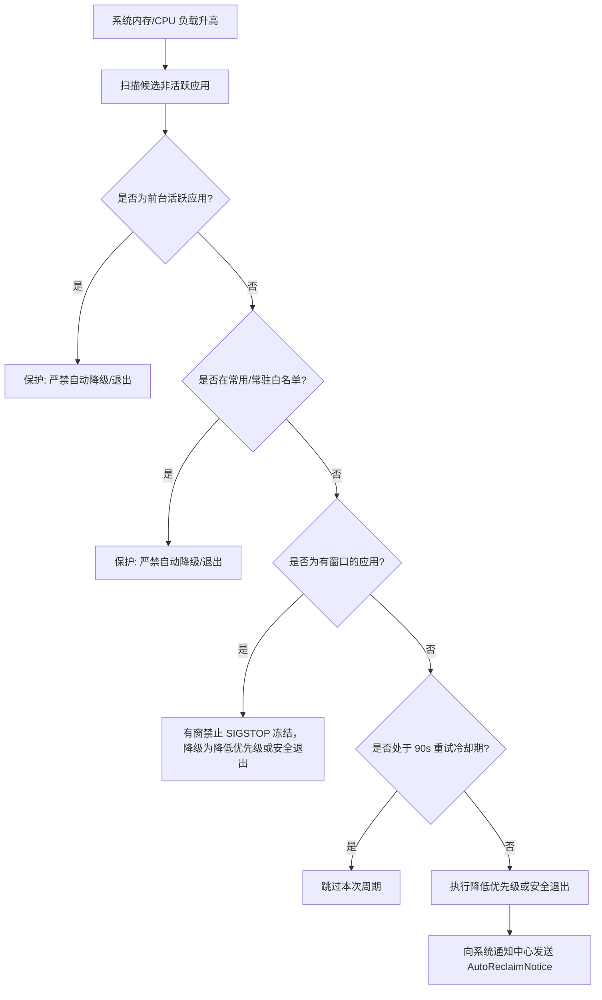

# 08. 系统通知与后台自动调度 (Reclaim Notifier)

## 系统通知与后台自动回收
- 用户称呼：系统通知、后台调度、自动回收提示、Auto Reclaim
- 入口：设置中开启 Level 1（半自动）；系统负载达到阈值且存在满足治理条件的后台应用时，后台自动触发
- 关键选择器：通知请求标识: `cc.resourcesteward.auto-reclaim.<UUID>`；通知分类: `UNNotificationRequest`；通知标题: `notice.title`（如 `"已自动调整应用资源"`）；通知内容: `notice.body`（如 `"已降低后台应用 Xcode 的优先级"`）；系统通知横幅: `NotificationCenter`
- 子功能：后台静默执行资源回收（限制为降优先级或退出，无冻结）、治理完成后发送系统横幅通知附带提示音、通知中心历史记录归档、系统进程/常驻白名单严格防误触
- 前置条件：设置中开启 Level 1；已授予 ResourceSteward 系统通知权限
- 常见故障现象：执行了治理但未收到通知 → 系统通知权限未授权，或系统开启了“勿扰模式 / 专注模式”；目标应用未被自动处理 → 命中 90 秒动作冷却或窗口保护策略

---

### 可见控件与属性字典

| 元素名称 | 实现载体 | 系统层级 | 标识与字段 | 内容与格式 | 行为与呈现 |
|---|---|---|---|---|---|
| 通知请求标识 | `UNNotificationRequest` | macOS UserNotifications | `identifier: "cc.resourcesteward.auto-reclaim.<UUID>"` | 唯一 UUID 追踪每次调度 | 用于系统去重与防抖 |
| 通知主标题 | `UNMutableNotificationContent.title` | 桌面横幅顶部 | `notice.title` | `"已自动调整应用资源"` | 明确业务行为 |
| 通知正文说明 | `UNMutableNotificationContent.body` | 桌面横幅正文 | `notice.body` | `"已降低后台应用 <AppName> 的优先级"` 或退出提示 | 诚实传达所执行动作 |
| 提示音效 | `content.sound` | 系统音频 | `.default` | macOS 默认提示音 | 声音辅助感知 |
| 呈现方式选项 | `UNNotificationPresentationOptions` | 通知中心调度 | `[.banner, .list, .sound]` | 屏幕右上角气泡横幅 + 通知中心抽屉归档 | 前台运行时亦可见 |

### 后台保护与安全兜底机制



### 自动化测试代码参考

```applescript
-- AppleScript: 验证系统通知中心中是否存在资源管家的最新通知
tell application "System Events"
    tell process "NotificationCenter"
        set nList to every window
        -- 检查是否有包含 "已自动调整应用资源" 的通知卡片
    end tell
end tell
```
